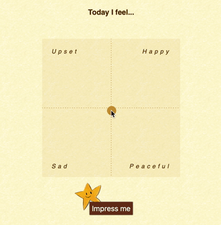

Meldy - A mood-based melody generator
=====================================

— Made by Matteo Bernardini (10743181) and Yilin Zhu (10702368).

Meldy is a simple grammar-model melody generator, based on a user-provided mood expressed in the valence-arousal plane.
It's developed as project for "Advanced Coding Tools and Methodologies" and "Computer Music: Representations and Models" courses of the MSc in Music and Acoustic Engineering of Politecnico di Milano.

The slides for ACTAM can be found [here](https://mttbernardini.github.io/nuvola/docs/slides.html).

Demo Video
----------

Project Description
-------------------

The focus of this application is on the Melody Generation step.

**TODO**

### Mood Selection

**TODO**

### Melody Generation

**TODO**

### Score display

**TODO**

Resources
---------

- [music21][m21]: a toolkit for computer-aided musicology.
- [OpenSheetMusicDisplay][osmd]: renders MusicXML sheet music in the browser.
- [OSMD Audio Player][osmd-ap]: browser based audio player for MusicXML scores.
- [p5.js][p5]: JavaScript port of Processing.
- [webpack][wp]: a bundler for JavaScript and friends.
- [Flask][flask]: Python micro framework for building web applications.
- [Pipenv][penv]: Python development workflow for humans.

Bibliography
------------

- [McCormack, J. (1996). Grammar based music composition. _Complex systems,_ 96, 321-336.][grammar]
- [Cuthbert, M., Ariza, C., Hogue, B., & Oberholtzer, J. W. (2020). Music21 Documentation][m21doc]
- Sarti, A. (2019). Computer Music: Representation and Models. _Course material of MSc in Music and Acoustic Engineering_

----
 © 2020 Matteo Bernardini & Yilin Zhu

[m21]:     http://web.mit.edu/music21/
[osmd]:    https://opensheetmusicdisplay.org/
[osmd-ap]: https://github.com/jimutt/osmd-audio-player
[p5]:      https://p5js.org/
[flask]:   https://palletsprojects.com/p/flask/
[wp]:      https://webpack.js.org/
[penv]:    https://pipenv.pypa.io/en/latest/

[grammar]: http://users.monash.edu.au/~jonmc/research/Papers/L-systemsMusic.pdf
[m21doc]:  http://web.mit.edu/music21/doc/index.html