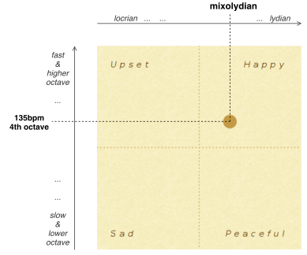
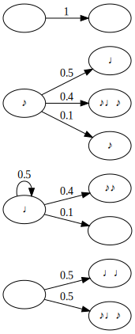

Grammar-based melody generation
===============================

After the mapping of `valence` and `arousal` into `mode`, `tempo` and `octave`, four other music features need to be defined in order to produce a complete melody:

Time signature
--------------

The rhythmic pattern of the melody can express different moods, for example a 4/4 pattern for western cultures represents stability, a 3/4 reminds of danceability, while odd time signatures like 7/8 create tension and instabilities.

As a start, we decided for our project to ignore this aspect and simply stick on a 4/4, in order to have a better focus on the other main features and simplify the approach for durations generation (see later).

Key signature
-------------

The key of the piece is represented both by a **root note** and a **mode**. In our case the mode is already derived from the `valence`, so the missing choice is the root note.

A possible approach could be to vary the root note together with the octave in a continuous way, based on the `arousal`.
The approach we chose, instead, is to simply pick a random root within the possible 12 pitches of the cromatic scale.

A problem we faced in this step is related to enharmonic equivalence. Not all possible combinations of root _names_ and mode are theoretically valid.

For example, "C# ionian" is a valid key signature, requiring all 7 degrees to be sharp, while "G# ionian" is not, as it would require a double-sharp for the 7th degree (F## → G#), therefore it is written as "Ab ionian" instead (enharmonic equivalent), which requires 4 flats and it's also easier to read.

A first solution would be to pick the usual name for each pitch:

	C C# D Eb E F F# G Ab A Bb B

However introducing modes complicates things a bit: althought "G# ionian" is not valid, "G# phrygian" is a legit key signature, as it corresponds to the same alterations of "E ionian", while "Ab phrygian" is not, as it would correspond to "D## ionian". The reality is that the above mentioned names are "usual" only if considering an "ionian" mode.

Since we decided to pick the root note at random anyway, we could fix this issue in a fairly simple way: instead of randomly choosing directly the root note, we first randomly choose a "base root" in ionian mode from the mentioned usual names. Then, based on the actual mode, we "rotate" the base root to the final root, based on the degree on which the mode is built (e.g. if we pick "C#" and the mode is "mixolydian", the root will be "G#", since "mixolydian" is built on the 5th degree of the ionian scale). We do this by taking advantage of `music21` interval-aware transposition (i.e. not just half-tones, but fully qualified intervals in terms of number and mode, e.g. "perfect fifth").

Melodic sequence
----------------

We wouldn't have a melody without actual notes that compose it.
Our approach was to set up a grammar-based model and then start to build some rules by trial and error, starting from simple Markov Chains.

We also setup the model in a way to use different rulesets depending on the values of `valence` and `arousal`, in order to increase variability and be more flexible.
The way we do it is by quantizing the continuous domain of a value (e.g. valence) into samples where we want to introduce a different ruleset. For example, if the continuous value is `0.67` and we have two rulesets, one for `0.2` and another for `0.8`, we would pick the one at `0.8` since it is _closer_ to the continuous value.

Each note is characterized by two properties, its **pitch** and its **duration**. We decided to adopt two separate and independent grammars for generating each of the two properties (see [`/back-end/data/grades.yml`](/back-end/data/grades.yml) and [`/back-end/data/durations.yml`](/back-end/data/durations.yml)

### Pitches

Since we are deriving the key signature from the input mood, it makes more sense to define a grammar of relative degrees, instead of actual pitches, and then do the proper transpositions with `music21` afterwards.

Thinking about the `valence`, we observed that "positive" pieces generally have some sort of "uplifting" melody, while "negative" pieces have a "downwards" melody, so we decided to define two different rulesets at `0` and `1`:

- The ruleset for high valence has higher probabilities in transitioning degrees in an "uplifting" manner (e.g. 1→3→5→8), and tends to create _consonant_ melodic intervals (graph below).
- The ruleset for low valence tends to create _dissonant_ melodic intervals.

### Durations

Generating durations through a grammar is a bit tricky because we still have to provide accent clues that follow the underlying time signature.
Instead of trying to define a grammar which is relative to the time-signature and can then been transformed to actual durations, we decided to simplify the task by stickying to 4/4 and defining durations where 1 = quarter note.

We decided to vary between three rulesets based on `arousal`, where:

- The ruleset for high arousal tends to add more faster notes (8ths and 16ths) and syncopations (graph below).
- The ruleset for middle arousal tends to remove faster notes and syncopations.
- The ruleset for low arousal prefers very simple and straight rhythms.

